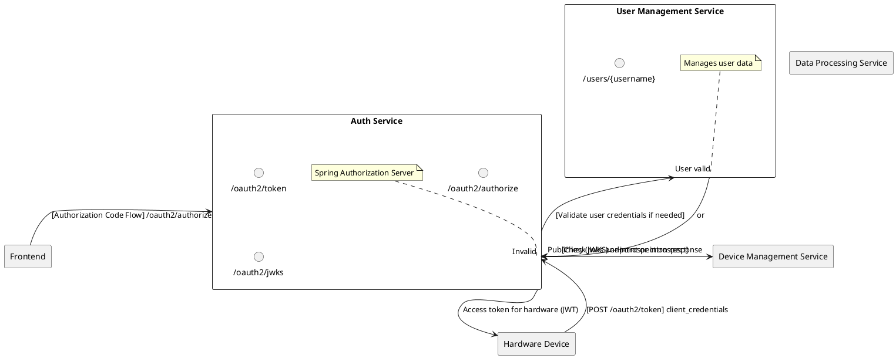
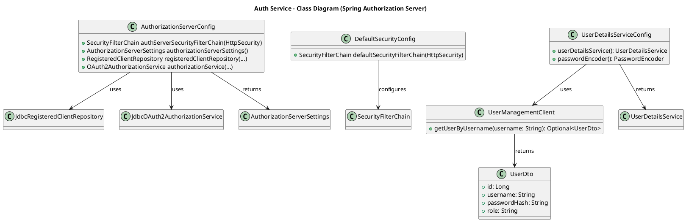

# Auth Service

## Overview
The Auth Service now leverages **Spring Authorization Server**, implementing a **standards-based OAuth 2.1** flow. It handles **authentication** and **authorization** for the IoT application, issuing and validating **JWT tokens**. User profiles and passwords remain in the **User Management Service** (UMS); the Auth Service contacts UMS (optionally) to verify credentials or load user details.

This setup also supports **machine-to-machine** (client credentials) authentication (e.g., for a hardware device).

---

## Responsibilities

1. **OAuth 2.1 Token Issuance**
    - Issues tokens (access/refresh) for both user-based (Authorization Code, Password) and machine-based (Client Credentials) grants.
    - Integrates with a PostgreSQL database for persistent storage of registered clients and active authorizations.

2. **Token Validation**
    - Provides standard OAuth2 endpoints (e.g., `/oauth2/jwks`) for resource servers to validate JWT signatures.
    - Other microservices validate tokens automatically if configured as **OAuth2 Resource Servers**.

3. **Authorization Rules**
    - Supports scoping and role-based logic (e.g., `iot.read`, `iot.write`) for device or user permissions.
    - Delegates advanced user profile management and credential storage to the UMS.

4. **Endpoints**
    - Standard OAuth2 endpoints:
        - `/oauth2/authorize` (for interactive flows like Authorization Code)
        - `/oauth2/token` (for requesting and refreshing tokens)
        - `/oauth2/jwks` (JSON Web Key Set for validating JWT signatures)
        - `/oauth2/introspect` & `/oauth2/revoke` (optional)
    - **Note**: Custom endpoints like `/login`, `/validate`, `/refresh` are no longer necessary with Spring Authorization Server.

---

## Proposed Architecture

### Textual Description

1. **OAuth2 Authorization Server**
    - Defines registered clients (e.g., `frontend-client`, `hardware-device`) and grants (authorization_code, client_credentials, refresh_token).
    - Stores tokens and client configurations in **PostgreSQL** (`authdb` or a dedicated schema).

2. **User Credentials**
    - For user-based logins, the Auth Service calls the **User Management Service** to validate usernames and hashed passwords, or it configures a custom `UserDetailsService` that fetches user data from UMS.

3. **Scalable & Standards-Based**
    - Runs as a Spring Boot microservice in Docker/Kubernetes.
    - Other services become **OAuth2 Resource Servers**, fetching this Auth Service’s JWKS for token validation.

### OAuth2 Flow Explanation

- **Interactive Users (Frontend)**:
    1. The user tries to log in via the frontend.
    2. The frontend redirects to `/oauth2/authorize` in the Auth Service.
    3. The Auth Service checks user credentials (possibly via UMS).
    4. On success, the Auth Service issues an **authorization code**, which the frontend exchanges for an **access token** at `/oauth2/token`.
    5. The frontend uses that access token to call microservices.

- **Hardware Device (Client Credentials)**:
    1. The device directly calls `/oauth2/token` with its `client_id` and `client_secret`.
    2. The Auth Service returns an **access token** with scopes like `iot.read`/`iot.write`.
    3. The hardware device can now call secure endpoints in other services using that token.

---

## Updated Class Diagram

### Diagram Explanation

1. **AuthorizationServerConfig**
    - Main config for Spring Authorization Server.
    - Sets up endpoints (`/oauth2/token`, `/oauth2/authorize`, `/oauth2/jwks`), client definitions, token storage in PostgreSQL.

2. **DefaultSecurityConfig**
    - Basic Spring Security chain for any non-OAuth endpoints or default login pages.

3. **UserDetailsServiceConfig**
    - Optionally defines how user credentials are fetched (via `UserManagementClient`) if you support password-based or user-based flows.

4. **UserManagementClient**
    - A simple class that calls the **User Management Service** (UMS) to retrieve user details.

5. **JdbcRegisteredClientRepository** / **JdbcOAuth2AuthorizationService**
    - Classes from Spring Authorization Server that store **client registrations** and **OAuth2 authorizations** in PostgreSQL.

---

## Interfaces with Other Services

1. **User Management Service**
    - **Purpose**: Provides user data and hashed passwords.
    - **Endpoints**: `/users/{username}`, or a custom route, for verifying credentials.

2. **Device Management & Data Processing Services**
    - **Type**: OAuth2 **Resource Servers**.
    - Rely on Auth Service’s JWKS or issuer URI for token validation.

3. **Frontend**
    - Uses standard OAuth2 flows (e.g., **Authorization Code**).

4. **Hardware Device**
    - Uses **Client Credentials** flow to obtain tokens without a user login.

---

## Security & Maintenance

- **Use PostgreSQL**
    - Credentials: `jdbc:postgresql://postgres:5432/authdb` (or a separate schema in the main `iotdb`).
    - Store and retrieve **Registered Clients** and **OAuth tokens**.

- **Rotate Client Secrets**
    - If your hardware device has a long-lived client secret, consider a rotation strategy.

- **User Credential Validation**
    - For user-based flows, integrate a `UserDetailsService` or REST calls to the UMS. Keep password hashing consistent between services.

- **Scaling**
    - Run multiple Auth Service instances (stateless tokens) behind a load balancer. All instances share the same `authdb` so token revocations and approvals stay in sync.

---

## Project Information

- **Programming Language**: Java (version 21)
- **Framework**: Spring Boot 3.4.1
- **Build Tool**: Maven
- **Dependencies**:
    - Spring Boot Starters (Actuator, Data JPA, Security, Validation, Web, Mail)
    - **Spring Boot Starter OAuth2 Authorization Server** (Key for OAuth 2.1 flows)
    - Lombok
    - PostgreSQL Driver (for storing OAuth client + token data)
    - Micrometer (InfluxDB)
    - Spring Boot Docker Compose
    - Spring Boot DevTools (for development)
    - Spring Boot Starter Test (for testing)
    - Spring Security Test (for security testing)
- **SCM Repository**: [GitHub - Auth Service](https://github.com/doemefu/auth-service)
- **License**: Apache License, Version 2.0 ([link](https://www.apache.org/licenses/LICENSE-2.0))
- **Issues**: [GitHub Issues](https://github.com/doemefu/auth-service/issues)

---

## Endpoints Summary (OAuth2 Focus)

> These endpoints are **standard** to Spring Authorization Server.

- **`GET /oauth2/authorize`**
    - Used by clients to start an Authorization Code flow.

- **`POST /oauth2/token`**
    - Exchanges auth codes for tokens.
    - Supports **client_credentials** and **refresh_token** flows too.

- **`GET /oauth2/jwks`**
    - Publishes the public keys used to sign JWTs, so resource servers can validate tokens.

- **`POST /oauth2/introspect`** (Optional)
    - Allows resource servers to validate tokens if they don’t directly parse JWT.

- **`POST /oauth2/revoke`** (Optional)
    - Allows clients to revoke tokens.

---

## How the OAuth Stuff Works

1. **Registered Clients**
    - Defined in `AuthorizationServerConfig` (in-memory) or stored in PostgreSQL via `JdbcRegisteredClientRepository`.
    - Each client has a `clientId`, `clientSecret`, allowed grant types (e.g., `authorization_code`, `client_credentials`), and assigned scopes.

2. **Token Issuance**
    - When a client calls `/oauth2/token`, the Auth Server verifies credentials and issues an **access token** (and optionally a refresh token).
    - Access tokens are **JWTs**, signed by a private key or a symmetric secret.

3. **Token Validation**
    - Resource servers can fetch the Auth Server’s **JSON Web Key Set** (`/oauth2/jwks`) to validate the JWT signature.
    - Alternatively, they can use the `issuer-uri` property to auto-discover the keys.

4. **Refresh Tokens**
    - For flows that allow refresh (e.g., authorization_code, password), the Auth Server persists the refresh token in the DB.
    - Clients can use this token to request a new access token when the old one expires.

5. **Integration with UMS**
    - If a user-based flow requires verifying username and password, the Auth Service references the UMS (via a `UserManagementClient`) to confirm hashed passwords, roles, etc.

6. **Machine Clients** (Hardware Device)
    - If you register a hardware device with `client_credentials` flow, it sends its `client_id` and `client_secret` to `/oauth2/token` and receives a token with predefined scopes (e.g., `iot.read`, `iot.write`).
    - This token can be used for non-user-bound IoT operations.

---