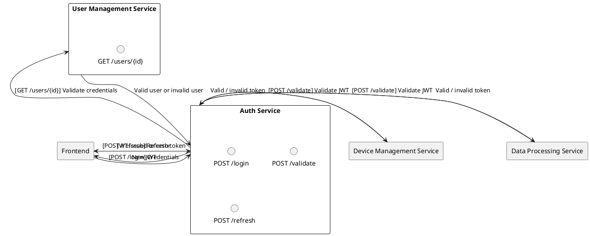
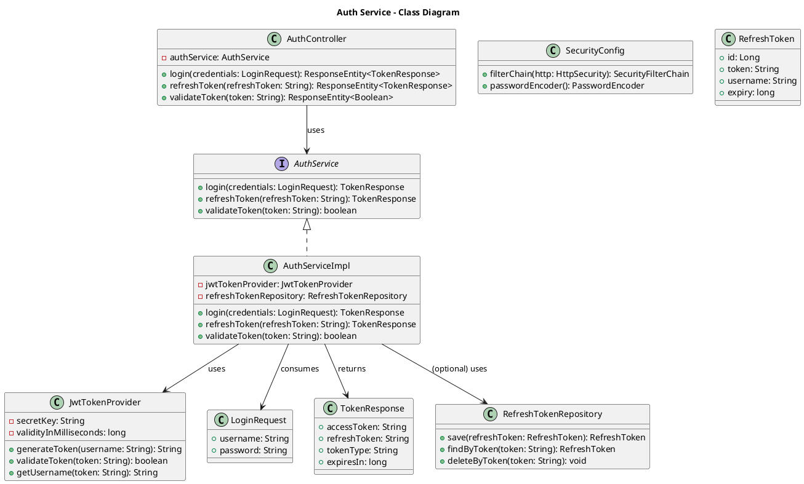

# Auth Service

## Overview
The Auth Service handles **authentication** and **authorization** in the IoT application. It issues and validates **JWT tokens** and delegates any user profile management to the **User Management Service**.

---

## Responsibilities
1. **Token Issuance & Validation**
    - Issue JWTs upon successful user login.
    - Validate incoming JWTs for other microservices.

2. **Authorization Rules**
    - Maintain a mapping of roles (`admin`, `user`) to specific permissions.
    - Provide a secure way for services (e.g., Device Management Service) to verify a user’s or device’s authorization levels.

3. **Endpoints**
    - `/login`: Accepts credentials, issues JWT.
    - `/validate`: Validates JWT for other services (internal endpoint).
    - `/refresh`: Issues a new JWT if the current one is about to expire.
    - **Best-Practice Suggestion:** For password resets and changes, the Auth Service can coordinate with the User Management Service. Implementation details vary depending on your security policies.

---

## Proposed Architecture

### Textual Description
1. **JWT Issuance**  
   When the user logs in (via the Frontend), the Auth Service checks credentials (in collaboration with the User Management Service) and issues a signed JWT.

2. **JWT Validation**  
   Other services send the JWT to the Auth Service for validation or use a shared secret/public key approach to validate tokens independently.

3. **Scalable Design**  
   Runs as a Spring Boot microservice, packaged in Docker. Can be deployed locally via Docker Compose or in production with K3s.

### Class Diagram

### Diagram Explanation

1. **AuthService** (Interface)
    - Defines the core contract for login, token refresh, and validation.

2. **AuthServiceImpl** (Implementation)
    - Implements the `AuthService` methods.
    - Uses `JwtTokenProvider` to generate/validate JWTs.
    - Optionally uses `RefreshTokenRepository` to persist/lookup refresh tokens.

3. **AuthController**
    - Exposes REST endpoints (`/login`, `/refresh`, `/validate`).
    - Delegates logic to `AuthService`.

4. **JwtTokenProvider**
    - Creates and validates JWT tokens using a secret key, handles expiration times, and extracts the username from the token.

5. **SecurityConfig**
    - Configures Spring Security HTTP rules and a `PasswordEncoder`.

6. **LoginRequest** & **TokenResponse**
    - **DTOs** for incoming/outgoing payloads: credentials in, JWT + refresh token out.

7. **RefreshToken** & **RefreshTokenRepository** (Optional)
    - **Entity** and **Repository** for storing refresh tokens in a local database.
    - If your design relies entirely on the User Management Service for credentials and doesn’t store refresh tokens locally, you can remove these.

---

## Interfaces with Other Services

1. **User Management Service**
    - **Type**: Internal REST API
    - **Endpoints**: `GET /users/{id}` for credential checks or other user details.

2. **Device Management Service**
    - **Type**: REST API calls for validating tokens.

3. **Data Processing Service**
    - **Type**: REST API calls for validating tokens.

4. **Frontend**
    - **Type**: REST (login, token refresh).

---

## Security & Maintenance
- **Best-Practice Suggestion**: Consider storing **client secrets** and **tokens** in a secure vault (e.g., HashiCorp Vault).
- **Best-Practice Suggestion**: Rotate JWT signing keys periodically for better security.
- **Auto-Scaling**: If user load spikes, replicate the Auth Service to handle more concurrent logins.

---

## Project Information
- **Programming Language**: Java (version 21)
- **Framework**: Spring Boot 3.4.1
- **Build Tool**: Maven
- **Dependencies**:
    - Spring Boot Starters (Actuator, Data JPA, Security, Validation, Web, Mail)
    - Lombok
    - PostgreSQL Driver
    - Micrometer (InfluxDB)
    - Spring Boot Docker Compose
    - Spring Boot DevTools (for development)
    - Spring Boot Starter Test (for testing)
    - Spring Security Test (for security testing)
- **SCM Repository**: [GitHub - Auth Service](https://github.com/doemefu/auth-service)
- **License**: Apache License, Version 2.0 ([link](https://www.apache.org/licenses/LICENSE-2.0))
- **Issues**: [GitHub Issues](https://github.com/doemefu/auth-service/issues)

---

## Endpoints Summary

- **POST /auth/login**  
  Accepts credentials (username, password) and returns a signed JWT (and optional refresh token).

- **POST /auth/refresh**  
  Accepts a valid refresh token to issue a new access token.

- **POST /auth/validate**  
  Validates the provided JWT; returns a boolean or status indicating token validity. (Typically used by other services internally.)

---